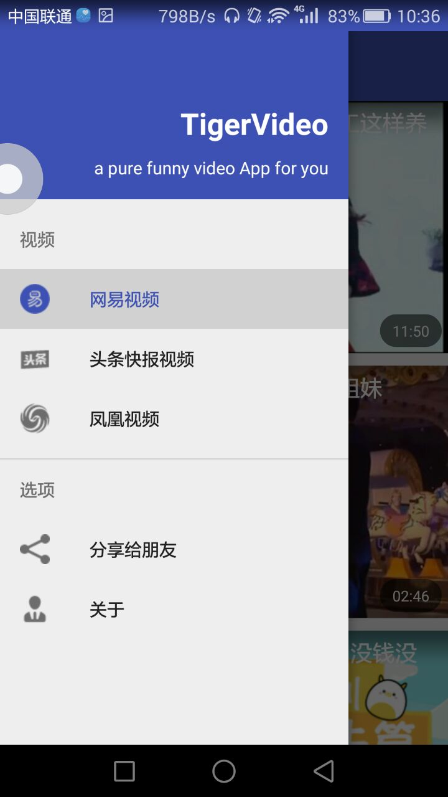

# TigerVideoPlayer

该`Library`实现了`Android`中的视频播放模块，视频播放控制与界面显示充分解耦，可自定义自己喜欢的内核播放器来实现播放功能(`MediaPlayer`,`ExoPlayer`等)。

个人公众号，欢迎扫码关注交流：   


# 功能
目前该库主要实现视频播放中的如下功能：
1. 列表中播放视频
2. 列表滑动时如果正在播放视频，则列表中播放的视频自动切换为小窗口浮动播放，滑动可恢复为正常播放
3. 支持配置打开或关闭小窗口播放功能，默认关闭
4. 各种播放模式切换到全屏播放
4. 实现了视频播放中的暂停，进度显示等各种常规操作
5. 视频全屏播放时支持左右滑动实现视频的快进和后退，支持右边上下滑动调整播放音量，左边上下滑动调整播放器的亮度等手势控制操作
6. 视频全屏播放时支持锁定当前播放状态
7. 支持直接进入全屏播放
8. 使用`AndroidVideoCache`实现视频缓存功能，该功能默认关闭，使用配置即可打开该缓存功能
9. 因视频播放内核与视频操作界面充分解耦，因此完全支持自定义自己喜欢的播放内核来实现视频播放
10. 该库实现了基于`MediaPlayer`和`ExoPlayer`两个内核的视频播放器，可以根据自己的需求配置。因为`ExoPlayer`需要`Context`，所以该库默认使用`MediaPlayer`内核播放器播放
11.支持自定义头部Title显示相关视图，支持自定义底部播放控制条视图，支持自定义全屏播放时手势操作相关显示视图，支持替换预览图ImageView，支持自定义加载失败显示视图

# TigerVideoPlayer的使用
该库实现了一行代码实现视频播放，一行代码开启小窗口播放，使用简单。

### Gradle
```
compile 'cn.ittiger:TigerVideoPlayer:1.7'
```

### 视频播放
```
<LinearLayout xmlns:android="http://schemas.android.com/apk/res/android"
              android:orientation="vertical"
              android:layout_width="match_parent"
              android:layout_height="match_parent">

    <cn.ittiger.player.VideoPlayerView
        android:id="@+id/video_player_view"
        android:layout_width="match_parent"
        android:layout_height="match_parent"/>

</LinearLayout>
```

```
//绑定视频地址和标题，这样视频播放功能就集成完成了，剩下的工作全部交由VideoPlayerView完成
mVideoPlayerView.bind(video.getVideoUrl(), video.getVideoTitle());
//显示视频预览图
Glide.with(mContext).load(video.getVideoThumbUrl()).into(holder.mPlayerView.getThumbImageView());
```

### 自定义播放器相关视图
```
<cn.ittiger.player.VideoPlayerView
        android:id="@+id/video_player_view"
        android:layout_width="match_parent"
        android:layout_height="match_parent"
        app:vpFullScreenGestureViewLayoutRes="@layout/my_fullscreen_gesture_view"
        app:vpVideoThumbViewLayoutRes="@layout/fresco_image_view"
        .../>
```
如上代码所示，如果要自定义全屏手势操作相关View，只需要在布局中添加自定义属性`app:vpFullScreenGestureViewLayoutRes`即可
1. 自定义布局my_fullscreen_gesture_view的根视图必须继承自FullScreenGestureView
2. 自定义底部播放控制条View时，必须继承自VideoControllerView
3. 自定义视频缩略图，必须继承自ImageView
4. 自定义加载失败View，不需要继承任何View
5. 自定义头部View时，必须继承自VideoHeaderView


### 自定义播放配置
```
//该配置最好在Application中实现
PlayerManager.loadConfig(
    new Config.Builder(this)
    .buildPlayerFactory(new ExoPlayerFactory(this))//使用ExoPlayer内核作为视频播放器，默认使用MediaPlayer
    .enableSmallWindowPlay()//开启小窗口播放，默认不开其
    .cache(true)//开启缓存功能，默认不开启
    .cacheProxy(HttpProxyCacheServer)//自定义缓存配置，不设置则采用默认的缓存配置
    .build()
);
```

### 自定义不同内核的播放器
1. 实现播放器抽象类`AbsSimplePlayer`，根据你需要的内核实现视频播放的相关功能
2. 实现`IPlayerFactory`接口，在方法`public AbsSimplePlayer create();`中返回对应的播放器对象
3. 通过配置`.buildPlayerFactory()`设置该播放器工厂

### 使用注意点
1. 对于需要使用全屏播放的`Activity`，需要在`AndroidManifest`中对该Activity配置`android:configChanges="orientation|screenSize|keyboardHidden"`
2. 不要使用默认的ActionBar，如有需要请使用v7包中的ToolBar(该问题后面会改进)，否则全屏播放会显示有问题
3. 对于Activity中视频播放时，最好在`onResume, onPause, onDestroy`方法中通过PlayerManager加上对应的方法:`resume, pause, release`
4. 对于在Fragment中播放视频时，在`onDestroyView`方法中调用`PlayerManager.getInstance.stop();`

#### 以上是`TigerVideoPlayer`使用的简单说明，具体使用请参考Demo

***********

# TigerVideo
基于多个开源库实现的一个视频播放App，练手项目
# 主要使用的开源库
Mosby(一个MVP框架)、RxJava、Retrofit2、ButterKnife、Glide、Systembartint、TigerDB、TigerVideoPlayer、Material Design相关控件

# 效果图




# 声明
本项目使用的视频数据分别来自于网易，头条快报，凤凰视频，在此表示感谢，视频数据API版权归原所属公司所有，请勿用于其他用途！若内容有侵权请联系本人进行删除处理，本项目仅供测试学习使用，他人不得滥用其中数据API，他人用于其他用途所造成的纠纷与本人无关。

# 关于作者
博客：[http://ittiger.cn](http://ittiger.cn)     
个人公众号，欢迎扫码关注交流：   


# LICENSE

Copyright 2016 huyongli(老胡)

Licensed under the Apache License, Version 2.0 (the "License");
you may not use this file except in compliance with the License.
You may obtain a copy of the License at

   http://www.apache.org/licenses/LICENSE-2.0

Unless required by applicable law or agreed to in writing, software
distributed under the License is distributed on an "AS IS" BASIS,
WITHOUT WARRANTIES OR CONDITIONS OF ANY KIND, either express or implied.
See the License for the specific language governing permissions and
limitations under the License.
